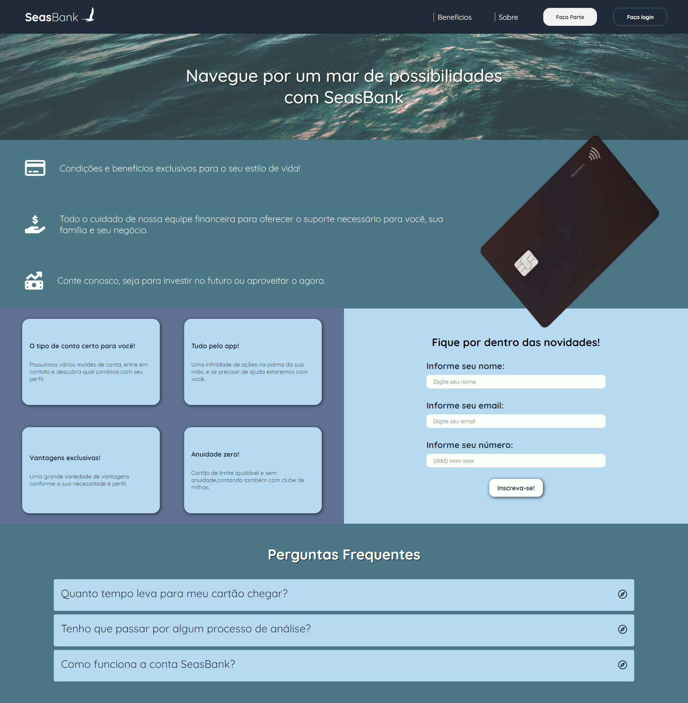

<h1 align="center"> Seas Bank </h1>

Projeto desenvolvido através do programa vem ser da DBC Company durante o módulo de Javascript 

  <a href="#-tecnologias">Tecnologias</a>&nbsp;&nbsp;&nbsp;|&nbsp;&nbsp;&nbsp;
  <a href="#-projeto">Projeto</a>&nbsp;&nbsp;&nbsp;|&nbsp;&nbsp;&nbsp;
  <a href="#-design">Design</a>&nbsp;&nbsp;&nbsp;|&nbsp;&nbsp;&nbsp;
  <a href="#-licença">Licença</a>

    🔵Landing Page do Seas

  

  <a href="https://seasbank-modulo-js.vercel.app/" target="_blank"> -> Acesse o deploy do projeto!</a>

 

## 🚀 Tecnologias

Esse projeto foi desenvolvido com as seguintes tecnologias:

-   HTML
-   CSS, Sass, Botstrap
-   Git e Github
-   Javascript

## 💻 Projeto

O Seas Bank é um internet banking com planos que se encaixam em diferentes realidades e um dashboard de fácil interação para controlar as suas finanças.

## 🎨 Design

O Seas possui ao todo 6 páginas:

-   Landing Page -> São apresentadas informações sobre a empresa e benefícios de obter um cartão.
-   Login Page -> Página dedicada para fazer login e direcionar o usuário para o dashboard do seu plano. Caso o usuário não tiver um plano ele ainda pode ser direcionado a página de planos para selecionar o seu cartão e então fazer o cadastro no nosso banco.
-   Plano Page -> A página de plano apresenta 3 opções de cartões para o usuário escolher, logo após escolher o cartão o usuário faz o cadastro no Seas.
-   Cadastro Page -> Esta página é dedicada ao cadastro e preenchimento de informações necessárias para abrir uma conta no Seas e fazer login na plataforma para acessas o dashboard.
-   DashBoard -> O dashboard é onde você controla as suas finanças com informações sobre seu saldo de conta, transferências, entradas e saídas.
-   Benefícios -> Essa página mostra as cotações sendo consideradas nas compras internacionais feitas pelo cartão Seas Bank e a lista de usuários que aprovaram o serviço

> Confira nosso figma para mais informações: <a href="https://www.figma.com/file/TeE3EuxF2qeCYmfIl4IU5I/SeasBank?node-id=0%3A1&t=ixenGRYFPNTQMBFp-1" target="_blank"> -> Acesse nosso design!</a>

## 🔘 Licença

Esse projeto está sob a licença MIT.

---

Made with 💙 by Carolina, Kellvin e Leonardo
